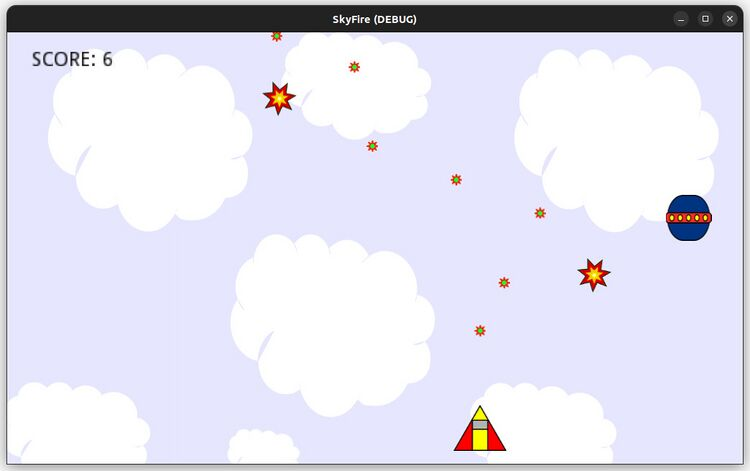

# Sky Fire

Autor: Saulo Popov Zambiasi

E-mail: saulopz@gmail.com

## Sobre

Esse jogo digital foi desenvolvido no motor [Godot Engine](https://godotengine.org/ "Godot Engine") como ferramenta para aprendizagem de desenvolvimento de jogos digitais em sala de aula usando um motor de jogo. O jogo é muito simples e o enfoque é conhecer alguns recursos da ferramenta durante o processo de criação.

Uma descrição para a criação do game se encontra na [minha wiki](https://saulo.arisa.com.br) de aulas, mais especificamente na página de [jogos digitais](https://saulo.arisa.com.br/wiki/index.php/Jogos_Digitais).
